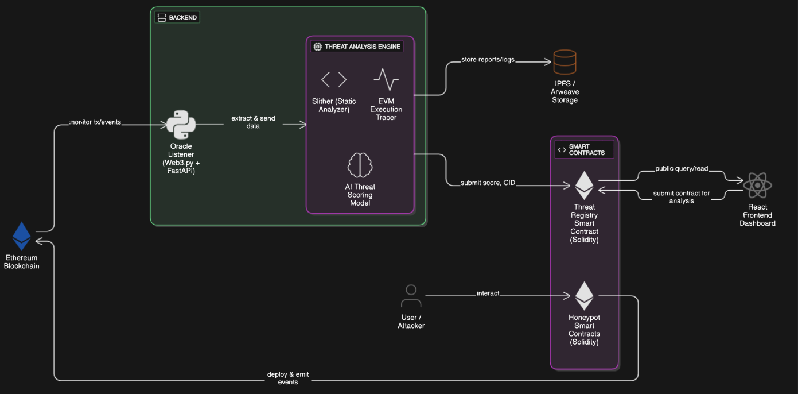

# 🛡️ HexSentinel

**Advanced Smart Contract Security Auditing Platform**

[](https://soliditylang.org/)
[](https://hardhat.org/)
[](https://python.org/)
[](https://nodejs.org/)

> HexSentinel is a comprehensive smart contract security auditing platform that combines static analysis, dynamic testing, and threat intelligence to identify vulnerabilities and security risks in Ethereum smart contracts.

## 📋 Table of Contents

- [Overview](#-overview)
- [Key Features](#-key-features)
- [Architecture](#-architecture)
- [Who is it for](#-who-is-it-for)
- [Features](#-features)
- [Project Structure](#-project-structure)
- [Installation](#-installation)
- [Usage](#-usage)
- [Components](#-components)
- [Security Examples](#-security-examples)
- [API Reference](#-api-reference)
- [Contributing](#-contributing)
- [License](#-license)
- [Acknowledgments](#-acknowledgments)

## 🔍 Overview

HexSentinel is a decentralized threat intelligence protocol that actively detects, analyzes, and flags malicious smart contracts on Ethereum using honeypots, AI-based behavior analysis, and a publicly accessible on-chain threat registry.

Unlike traditional smart contract scanners that rely on static analysis and centralized reporting, HexSentinel flips the model by using active deception. It deploys smart contract honeypots—contracts designed to appear vulnerable and valuable—to attract malicious actors and automated exploit bots. When an attacker interacts with a honeypot, HexSentinel captures the transaction, analyzes it using an AI engine, and assigns a risk score along with human-readable reasoning (e.g., “attempted reentrancy with suspicious gas pattern”).

If the behavior is deemed malicious, HexSentinel publishes a signed verdict to a decentralized, censorship-resistant smart contract registry on-chain. This allows wallets, dApps, protocols, and users to query the registry in real-time to determine whether a contract or wallet has been flagged for malicious behavior—before interacting with it.

## ⭐ Key Features

### 🔍 **Static Code Analysis**
- **Automated Vulnerability Detection**: Advanced pattern matching for 50+ vulnerability types
- **CVSS-based Scoring**: Industry-standard severity assessment (0-500 scale)
- **Professional PDF Reports**: Detailed audit documentation with findings

### 🎯 **Dynamic Transaction Analysis** 
- **Real-time Gas Pattern Monitoring**: Detects suspicious gas usage deviations from baseline behavior
- **ML-based Anomaly Detection**: Uses IsolationForest algorithm to identify behavioral anomalies in smart contract execution

### 🍯 **Deceptive Honeypots for Active Threat Capture**
- **Realistic Vulnerability Simulation**: Contracts that appear genuinely flawed to attract attackers
- **Attack Vector Cataloging**: Classification and documentation of attempted exploits

### 🤖 **AI-Based Behavioral Analysis** 
- **Explainable Threat Scoring**: Human-readable reasoning for every threat assessment
- **Confidence Metrics**: Reliability indicators for findings with weighted scoring (70% metrics, 30% ML)

### 📡 **Live Monitoring & Intelligence**
- **Real-time Contract Deployment Tracking**: Automatic scanning of new contracts
- **On-Chain Threat Registry**: Public, immutable registry of malicious addresses accessible by any dApp


##  Architecture

*Architecture Diagram: HexSentinel Security Auditing Platform*

## Who is it for

### 🔒 Security Analysis
- **Automated Vulnerability Detection**: Identifies common smart contract vulnerabilities
- **Reentrancy Attack Detection**: Specialized detection for CEI pattern violations
- **Access Control Analysis**: Verification of permission and role-based security
- **Gas Optimization**: Detection of inefficient gas usage patterns

### 📊 Threat Intelligence
- **Dynamic Risk Scoring**: Real-time threat assessment (0-500 scale)
- **Severity Classification**: High, Medium, Low, Informational categories
- **Confidence Metrics**: Reliability indicators for findings
- **Trend Analysis**: Historical vulnerability patterns

### 📈 Reporting & Analytics
- **Professional PDF Reports**: Detailed audit documentation
- **IPFS Integration**: Decentralized report storage
- **Audit Registry**: Blockchain-based audit tracking
- **Dashboard Visualization**: Interactive security metrics

### 🧪 Testing Framework
- **Honeypot Contracts**: Educational vulnerability examples
- **Test Environments**: Isolated testing scenarios
- **Attack Simulations**: Practical exploit demonstrations

## 📁 Project Structure

```
HexSentinel/
├── 📂 Backend/
│   ├── 📂 StaticAnalyzer/           # Core static analysis engine
│   │   ├── static_analyzer.py       # Main analyzer logic
│   │   ├── pdf_report_generator.py  # Report generation
│   │   └── 📂 test_env/             # Testing environment
│   └── 📂 DynamicAnalyzer/          # Real-time behavior analysis
│       ├── scripts/
│       │   ├── trace.js             # Transaction execution tracing
│       │   ├── computeMetrics.js    # Gas pattern & revert rate analysis
│       │   ├── ml_score.py          # ML-based anomaly detection
│       │   └── generateReport.js    # Combined threat assessment
│       └── contracts/
│           └── SimpleVault.sol      # Test contract for analysis
├── 📂 Frontend/                     # Web interface
├── 📂 ThreatSmartContract/          # Audit registry system
│   ├── contracts/
│   │   └── AuditRegistry.sol        # Main registry contract
│   ├── scripts/                     # Deployment scripts
│   └── test/                        # Contract tests
└── 📂 YieldFarmContract_HoneyPot/   # Educational examples
    ├── contracts/
    │   ├── YieldFarmVault.sol       # Vulnerable contract
    │   └── MaliciousReentrancy.sol  # Attack contract
    └── test/                        # Attack simulations
```

## 🚀 Installation

### Prerequisites

- **Node.js** v18+ and npm
- **Python** 3.13+
- **Hardhat** development environment

### Quick Start

1. **Clone the Repository**
   ```bash
   git clone https://github.com/your-org/HexSentinel.git
   cd HexSentinel
   ```

2. **Install Backend Dependencies**
   ```bash
   pip install -r requirements.txt
   
   # Install Node.js dependencies for Static Analyzer
   cd Backend/StaticAnalyzer
   npm install
   
   # Install Node.js dependencies for Dynamic Analyzer
   cd ../DynamicAnalyzer
   npm install
   ```

3. **Install Smart Contract Dependencies**
   ```bash
   cd ../../ThreatSmartContract
   npm install
   
   cd ../YieldFarmContract_HoneyPot
   npm install
   ```

4. **Configure Environment**
   ```bash
   cp .env.example .env
   # Edit .env with your configuration
   ```

5. **Compile Contracts**
   ```bash
   cd ThreatSmartContract
   npx hardhat compile
   
   cd ../YieldFarmContract_HoneyPot
   npx hardhat compile
   ```

## 💻 Usage

### Running Static Analysis

```bash
cd Backend/StaticAnalyzer
python static_analyzer.py --contract /path/to/contract.sol --output report.pdf
```

### Running Dynamic Analysis

```bash
cd Backend/DynamicAnalyzer

# Run complete dynamic analysis pipeline
npm run full-analysis

# Or run individual components:
npm run baseline      # Establish baseline behavior
npm run trace         # Execute transaction tracing
npm run metrics       # Compute gas & revert metrics
npm run ml-score      # Generate ML anomaly score
npm run report        # Generate final threat assessment
```

### Deploying Audit Registry

```bash
cd ThreatSmartContract
npx hardhat run scripts/deploy.js --network localhost
```

### Testing Vulnerability Examples

```bash
cd YieldFarmContract_HoneyPot
npx hardhat test
```

### Interacting with Registry

```bash
cd ThreatSmartContract
npx hardhat run scripts/interact.js --network localhost
```

## 🔧 Components

### 🔍 Static Analyzer (`Backend/StaticAnalyzer/`)

The core analysis engine that:
- Parses Solidity source code
- Applies security rules and patterns
- Calculates threat scores using CVSS-like methodology
- Generates comprehensive audit reports

**Key Features:**
- **Severity Scoring**: Weighted scoring system (High: 40pts, Medium: 20pts, Low: 10pts)
- **Confidence Metrics**: Reliability assessment for findings
- **AWS Integration**: Cloud storage for reports
- **IPFS Support**: Decentralized storage option

### 🎯 Dynamic Analyzer (`Backend/DynamicAnalyzer/`)

Real-time contract behavior analysis system with two core capabilities:

#### **1. Gas Pattern Analysis & Anomaly Detection**
- **Baseline Establishment**: Creates behavioral profiles from normal contract usage
- **Real-time Monitoring**: Tracks gas consumption patterns during execution
- **Deviation Detection**: Identifies suspicious gas usage that differs from baseline
- **Revert Rate Analysis**: Monitors transaction failure patterns

#### **2. ML-based Threat Scoring**
- **IsolationForest Algorithm**: Detects anomalous behavior in transaction patterns
- **Feature Extraction**: Analyzes gas usage, failure rates, and execution metrics
- **Weighted Scoring**: Combines multiple analysis methods (70% metrics, 30% ML)
- **Threat Classification**: Categorizes threats as LOW, MEDIUM, HIGH, or CRITICAL

**Analysis Pipeline:**
```bash
baseline → trace → metrics → ml-score → report
```

**Output Example:**
```json
{
  "combinedScore": 652,
  "threatLevel": "MEDIUM", 
  "gasAnalysis": {
    "deviation": 0.15,
    "score": 255
  },
  "mlAnomaly": {
    "score": 0.72,
    "isAnomalous": false
  }
}
```

###  Audit Registry (`ThreatSmartContract/`)

Blockchain-based audit tracking system:

```solidity
enum ThreatLevel { Safe, Low, Medium, High, Critical }

struct AuditReport {
    address contractAudited;
    ThreatLevel threatLevel;
    uint256 threatScore;
    string ipfsCid;
    uint256 timestamp;
    uint8 auditVersion;
}
```

## Honeypot Example (`YieldFarmContract_HoneyPot/`)

These honeypots can lure the attackers whom might have attacked other smart contracts we can analyze their transactions to find contracts and analyze them using HexSentinel to find the vulnerablity which can be used to secure the general audience from attacks by hackers or APT(Advanced Persistent Threats)

Educational vulnerability demonstrations:
- **Reentrancy Attacks**: Classic CEI pattern violations
- **Access Control Issues**: Permission bypass examples
- **Integer Overflow/Underflow**: Mathematical vulnerabilities


### Reentrancy Vulnerability

**Vulnerable Code:**
```solidity
function claimRewards() public {
    require(stakeBalance[msg.sender] > 0, "Nothing to claim");
    uint256 reward = stakeBalance[msg.sender] * 110 / 100;
    
    //  VULNERABILITY: External call before state update
    (bool sent, ) = msg.sender.call{value: reward}("");
    require(sent, "Transfer failed");
    
    stakeBalance[msg.sender] = 0; // Too late!
}
```

**Secure Implementation:**
```solidity
function claimRewards() public {
    require(stakeBalance[msg.sender] > 0, "Nothing to claim");
    uint256 reward = stakeBalance[msg.sender] * 110 / 100;
    
    //  SECURE: Update state before external call
    stakeBalance[msg.sender] = 0;
    
    (bool sent, ) = msg.sender.call{value: reward}("");
    require(sent, "Transfer failed");
}
```

##  API Reference

### Static Analyzer API

```python
from static_analyzer import main as SecurityAnalyzer

analyzer = SecurityAnalyzer()
results = analyzer.analyze_contract("contract.sol")
```

### Audit Registry API

```javascript
const registry = await ethers.getContractAt("AuditRegistry", address);
await registry.submitReport(contractAddress, threatLevel, score, ipfsCid);
```

## Acknowledgments

- **OpenZeppelin**: Secure smart contract libraries
- **Hardhat**: Ethereum development environment
- **Web3.py**: Python Ethereum library

### Checkout the sample scan report [here](demo/sample-report.pdf)
### Checkout the deployed Threat Audit Registry Smart contract deployed at [polygon amoy](https://amoy.polygonscan.com/tx/0xa8fe6b2c0d98d2c8e4330c92406d0b59cb3419d9ff7c39fe5376b8264b53b705)
### Check the data stored in the contract at the Transaction [event log](https://amoy.polygonscan.com/tx/0xa8fe6b2c0d98d2c8e4330c92406d0b59cb3419d9ff7c39fe5376b8264b53b705) 

